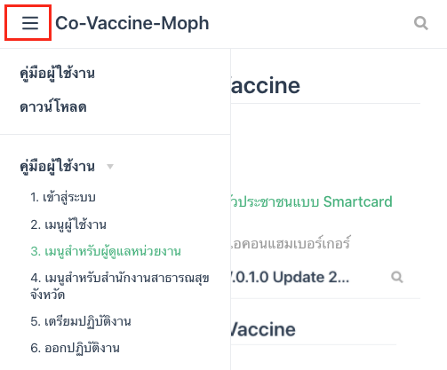

## คู่มือการใช้งานระบบ Active Case Findind (ACF)

1. [คู่มือการใช้งาน](../user/login.md)
2. [ช่องทางติดต่อสื่อสาร](../contact/index.md)
3. [การติดตั้งเครื่องอ่านบัตรประจำตัวประชาชนแบบ Smartcard](../smartcard/install.md)
4. [การติดตั้งเครื่อง Print Sticker](../setprintsticker/index.md)

<!-- >เมนูเพิ่มเติมอื่น ๆ สามารถกดปุ่มไอคอนแฮมเบอร์เกอร์

 -->

