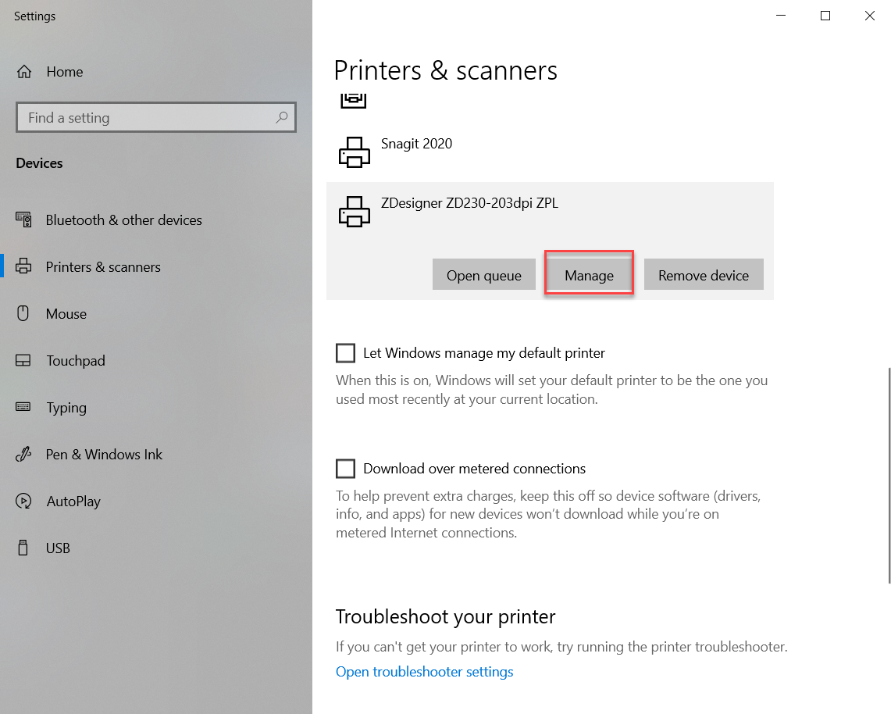
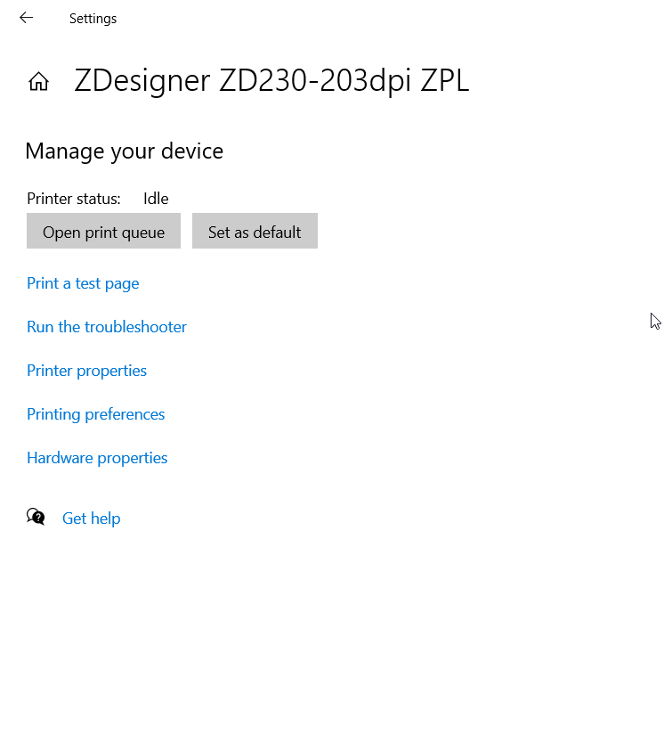
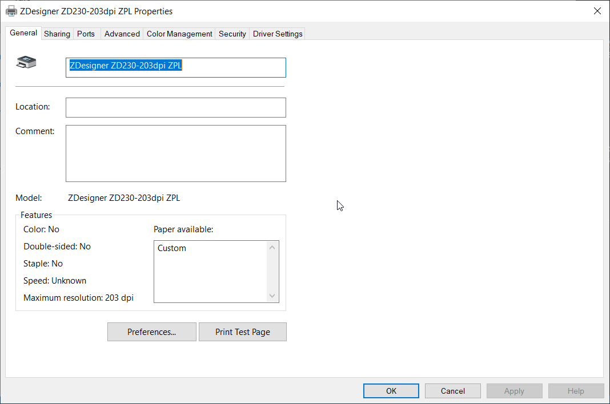

# การติดตั้งเครื่อง Print Sticker
1. add Printer
2. เลือก printer ที่เราได้ add ไปตามข้อ 1

3. เลือก Manage

4. เลือก Printer properties

5. เลือก Preferences 

6. เลือก ขนาดของ Sticker 

7. โดยสามารถเปลี่ยนหน่วยของ sticker ได้ > เลือก Units > จะมีให้เลือก 3 หน่วย 

