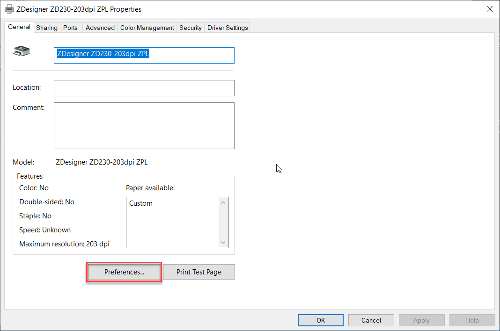

# การติดตั้งเครื่อง Print Sticker
1. add Printer
2. เลือก printer ที่เราได้ add ไปตามข้อ 1

3. เลือก Manage

4. เลือก Printer properties

5. เลือก Preferences 

6. เลือก ขนาดของ Sticker 

7. โดยสามารถเปลี่ยนหน่วยของ sticker ได้ > เลือก Units > จะมีให้เลือก 3 หน่วย 

การขอใช้สิทธิ์ admin ระดับจังหวัด 
สสจ. จะ add สิทธิ์ ให้ admin ระดับโรงพยาบาลทุกสังกัด ทั้งรัฐและเอกชน ภายในพื้นที่จังหวัด

สสจ. สามารถโหลดแบบฟอร์ม ได้จากหน้าเว็บไซต์ [`https://co-vaccine.moph.go.th/th/downloads`](https://co-vaccine.moph.go.th/th/downloads)  และส่งกลับมาที่ e-mail :  `co-vaccine@moph.go.th` รอการอนุมัติจากเจ้าหน้าที่และจะแจ้งผลการอนุมัติกลับทางอีเมล 

** 1 หน่วยงานสามารถขอสิทธิ์เป็น admin ได้  2 users  และ admin สามารถเพิ่มผู้ใช้งานและกำหนดสิทธิ์ให้กับ user ในหน่วยงานได้เองค่ะ  

ทั้งนี้ ขอความร่วมมือ โปรดทำหนังสือแจ้งรายชื่อเจ้าหน้าที่ เพื่อขอเข้าใช้สิทธิ์เป็น admin สสจ.  ส่งมายังศูนย์เทคโนฯ  (ตัวอย่างหนังสืออยู่ในหน้าดาวน์โหลด)

**การขอใช้สิทธิ์ของ รพ. ทุกสังกัด ทั้งรัฐและเอกชน ภายใต้ความดูแลของ สสจ.   ขอให้ รพ. ดาวน์โหลดแบบฟอร์มได้จากหน้าเว็บไซต์ [`https://co-vaccine.moph.go.th/th/downloads`](https://co-vaccine.moph.go.th/th/downloads)  และส่งกลับให้ทาง สสจ. เป็นผู้ดำเนินการเพิ่มและอนุมัติสิทธิ์

::: warning
การตั้งชื่อไฟล์ โปรดระบุชื่อหน่วยงาน ด้วยค่ะ  ขอบคุณค่ะ
:::