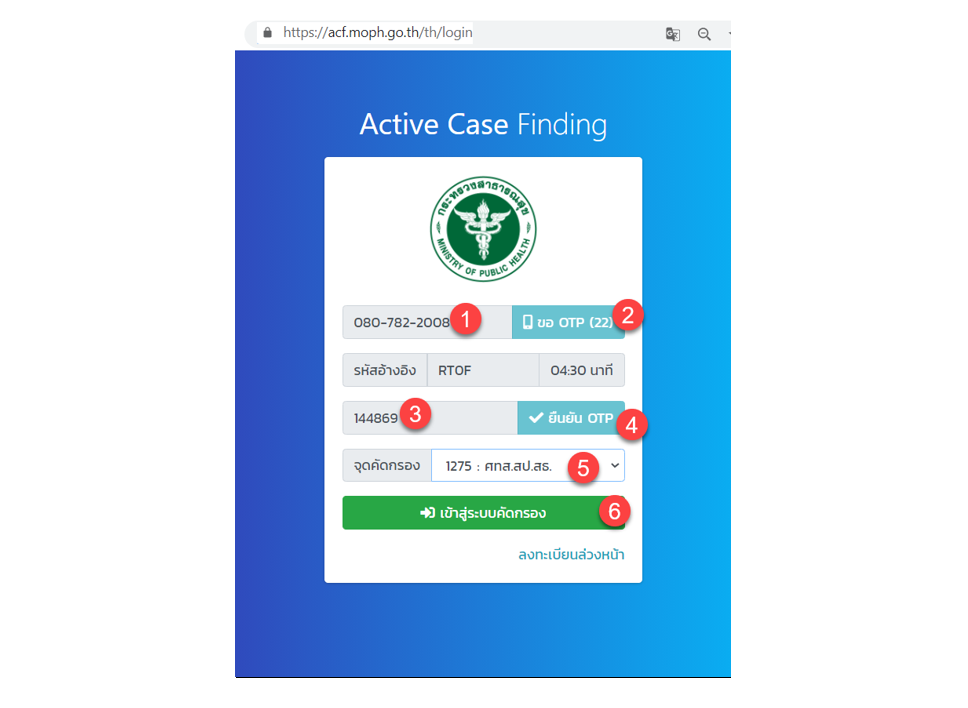
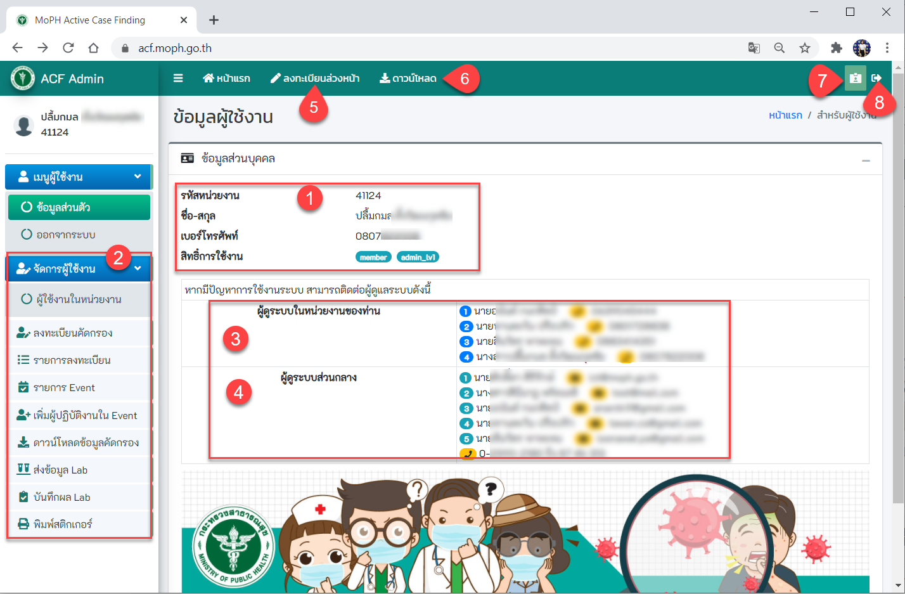
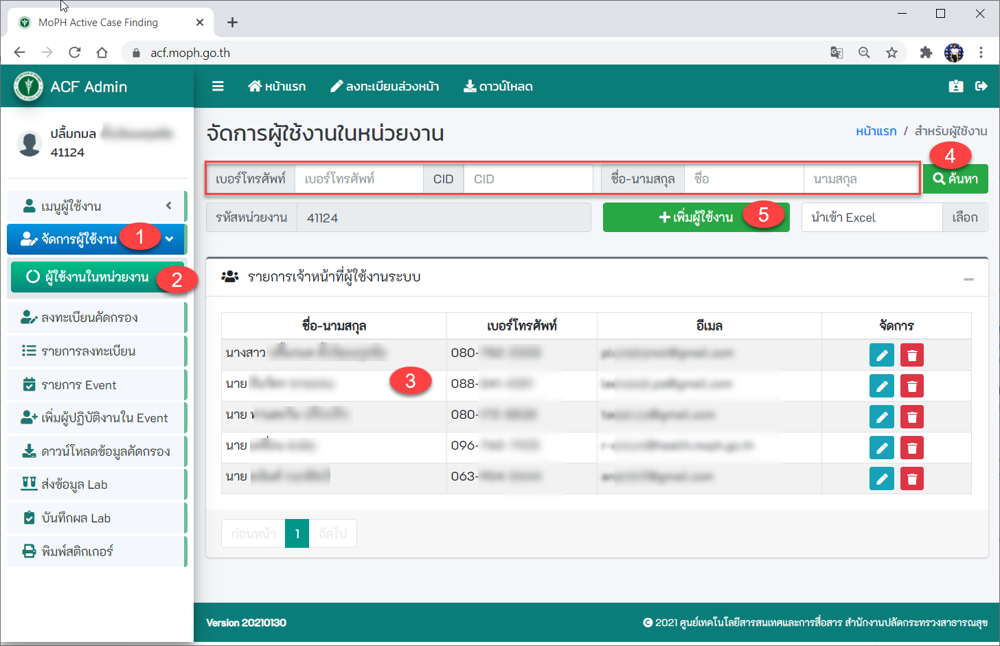
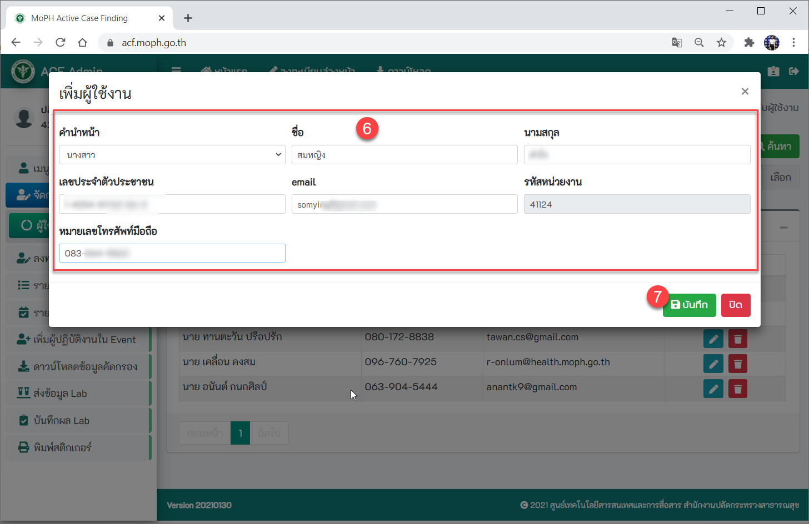
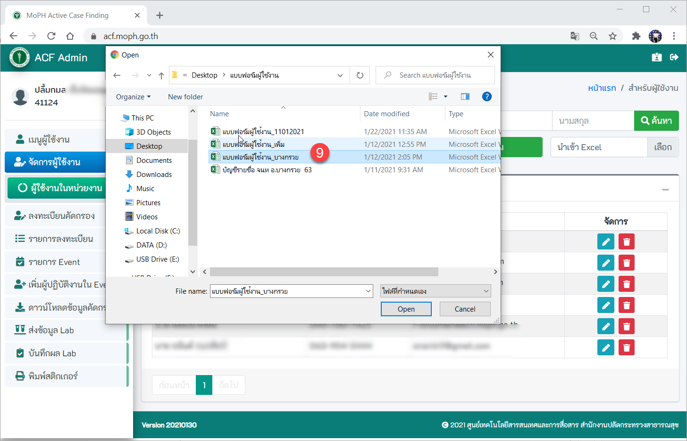
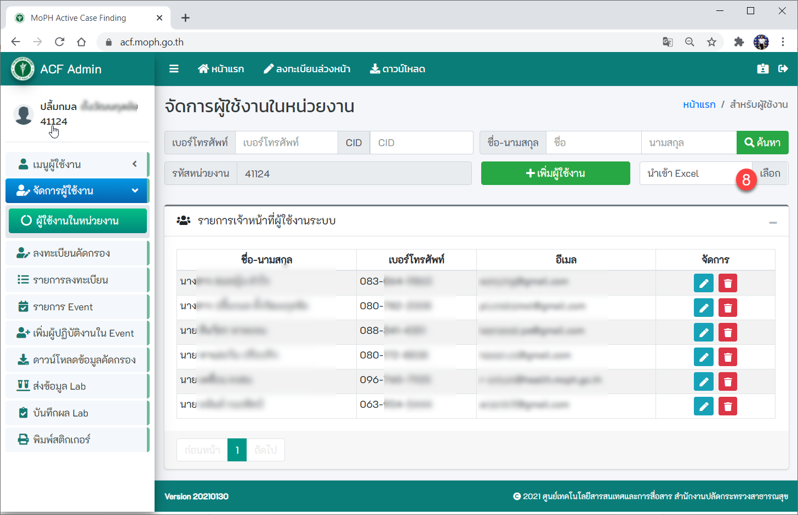
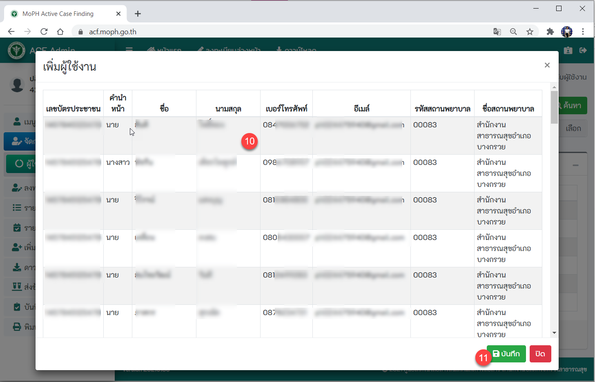

## 4.1. สำหรับผู้ดูแลระบบ (Admin) 
เมื่อดำเนินการตามเมนูขั้นตอนการขอใช้งานและระดับสิทธิ์ในการใช้ระบบเรียบร้อยแล้ว ก็เข้าสู่หน้าเว็บการใช้งานที่ [https://acf.moph.go.th](https://acf.moph.go.th/th/login)

## 4.2 หน้าจอ Login
1. กรอกเบอร์โทรศัพท์มือถือ
2. กดปุ่ม ขอ OTP (รหัส OTP จะส่งไปยังโทรศัพท์มือถือ)
3. กรอกรหัส OTP
4. กดปุ่มยืนยัน OTP
5. จุดคัดกรองของหน่วยงานท่าน (หากยังไม่มีจุดคัดกรอง (Event) ระบบจะเปลี่ยนเข้าสู่หน้าจอรายการ Event เพื่อสร้าง Event)
6. กดปุ่ม เข้าสู่ระบบคัดกรอง

## 4.3 หน้าจอข้อมูลผู้ใช้งาน
1. แสดงข้อมูลส่วนบุคคลของผู้ใช้งาน 
2. เมนูทั้งหมดที่ผู้ดูแลระบบ (Admin ระดับหน่วยงาน) สามารถใช้งานได้
3. แสดงข้อมูลผู้ดูแลระบบในหน่วยงานของท่าน (Admin ระดับหน่วยงาน)		
4. แสดงผู้ดูแลระบบส่วนกลาง (บุคลากรของศูนย์เทคโนโลยีสารสนเทศและการสื่อสาร)
	หาก Admin ระดับหน่วยงาน มีปัญหาในการใช้งาน สามารถติดต่อผู้ดูแลระบบส่วนกลางได้
5. เมนูลงทะเบียนล่วงหน้า ใช้ในกรณีที่ต้องการบันทึกการลงทะเบียนผู้ถูกคัดกรอง
6. เมนูดาวน์โหลด สามารถดาวน์โหลดแบบฟอร์มสำหรับเพิ่มผู้ใช้งาน 
7. เมนูข้อมูลส่วนบุคคล
8. เมนู ออกจากระบบ

## 4.4 หน้าจอจัดการผู้ใช้
ผู้ดูแลระบบระดับหน่วยงาน จะต้องดำเนินการเพิ่มสิทธิ์ให้ผู้ใช้งาน (User) ให้เจ้าหน้าที่ในโรงพยาบาล
1. เข้าเมนูจัดการผู้ใช้งาน
2. เข้าเมนูผู้ใช้งานในหน่วยงาน
3. จะแสดงรายชื่อเจ้าหน้าที่ผู้ใช้งานระบบทั้งหมดในหน่วยงาน
4. สามารถค้นหารายชื่อเจ้าหน้าที่ โดยระบุเบอร์โทรศัพท์/ CID/ ชื่-สกุล แล้วกดปุ่ม ค้นหา
5. การเพิ่มผู้ใช้งาน (จะเพิ่มได้ทีละรายชื่อ)

6. กรอกรายละเอียดผู้ใช้งาน (จะเพิ่มได้ทีละรายชื่อ)
7. กดปุ่ม บันทึก

8. สามารถเพิ่มรายชื่อจาก excel (โดยมีรูปแบบตามที่กำหนดให้) ทำให้สะดวกรวดเร็วในการเพิ่มรายชื่อจำนวนเยอะๆ คลิปปุ่ม เลือก

9. เลือกไฟล์ excel ที่เตรียมไว้ กดปุ่ม open

10. จะปรากฏรายชื่อผู้ใช้งานทั้งหมดในไฟล์ excel
11. กดปุ่มบันทึก

