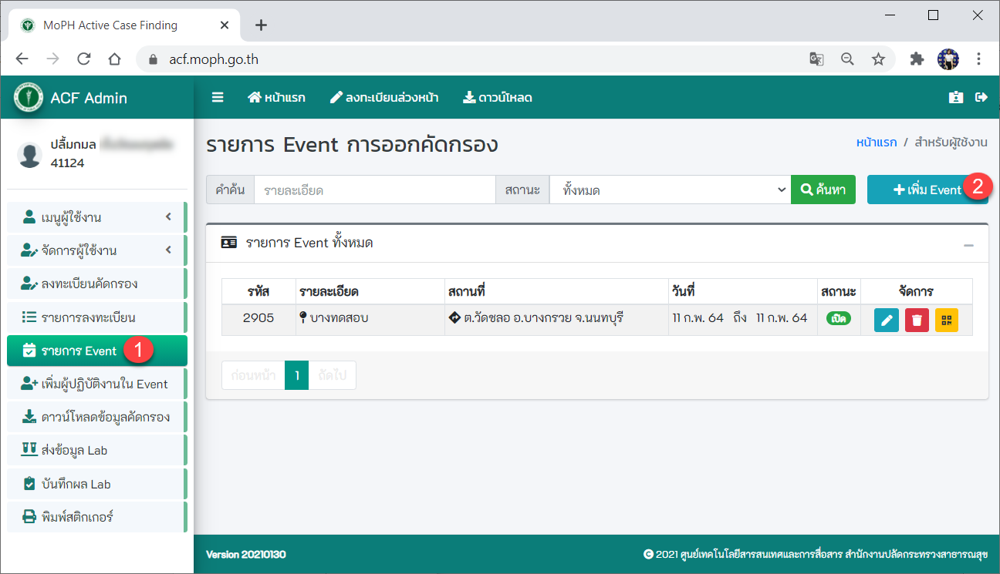
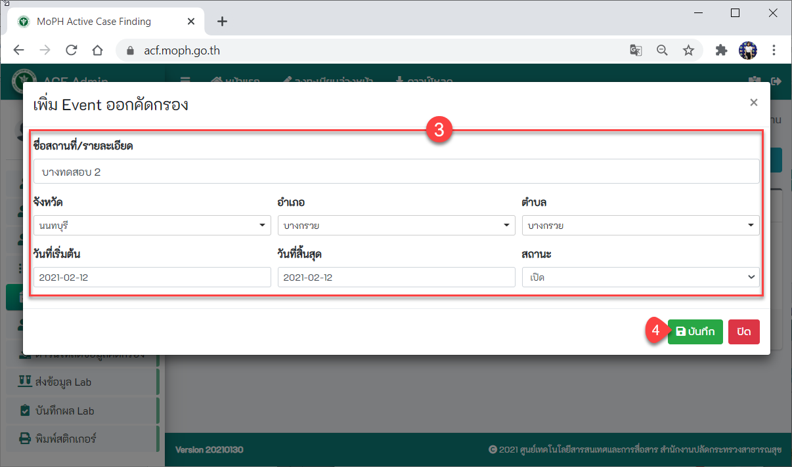
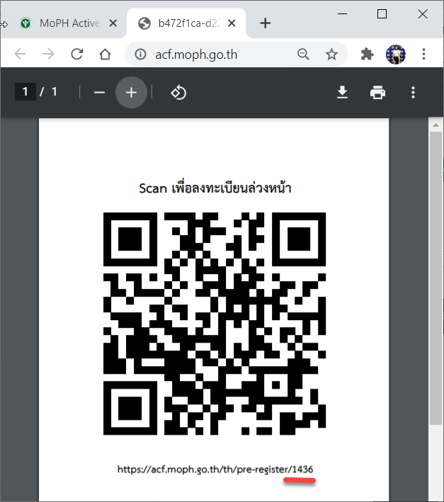
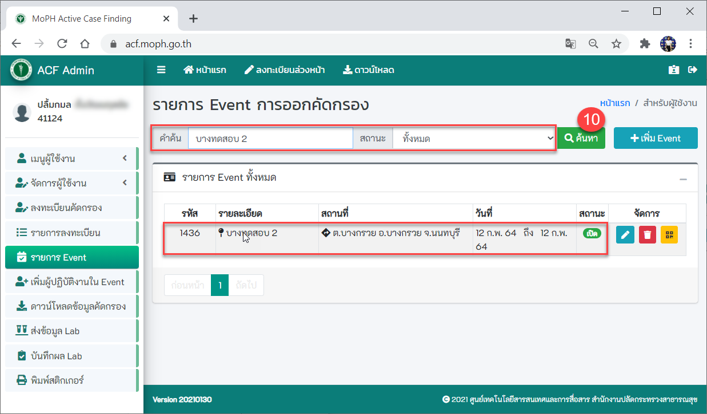
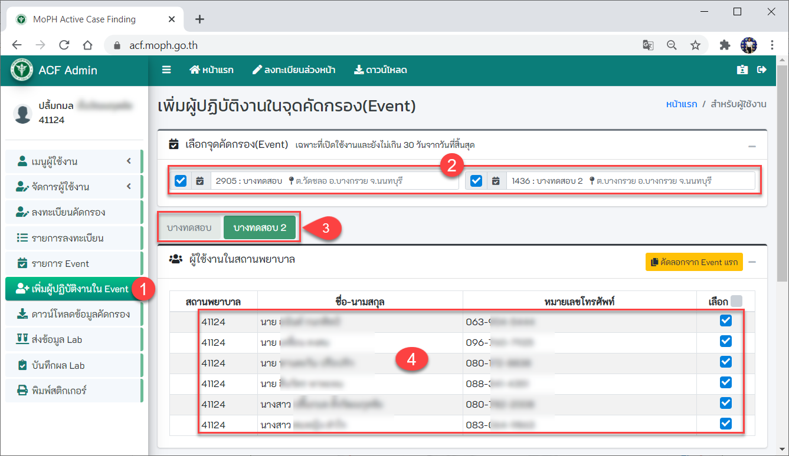

## 4.1. สำหรับผู้ดูแลระบบ (Admin) 
เมื่อดำเนินการตามเมนูขั้นตอนการขอใช้งานและระดับสิทธิ์ในการใช้ระบบเรียบร้อยแล้ว ก็เข้าสู่หน้าเว็บการใช้งานที่ [https://acf.moph.go.th](https://acf.moph.go.th/th/login)

## 4.2 หน้าจอ Login
1. กรอกเบอร์โทรศัพท์มือถือ
2. กดปุ่ม ขอ OTP (รหัส OTP จะส่งไปยังโทรศัพท์มือถือ)
3. กรอกรหัส OTP
4. กดปุ่มยืนยัน OTP
5. จุดคัดกรองของหน่วยงานท่าน (หากยังไม่มีจุดคัดกรอง (Event) ระบบจะเปลี่ยนเข้าสู่หน้าจอรายการ Event เพื่อสร้าง Event)
6. กดปุ่ม เข้าสู่ระบบคัดกรอง

## 4.3 หน้าจอข้อมูลผู้ใช้งาน
1. แสดงข้อมูลส่วนบุคคลของผู้ใช้งาน 
2. เมนูทั้งหมดที่ผู้ดูแลระบบ (Admin ระดับหน่วยงาน) สามารถใช้งานได้
3. แสดงข้อมูลผู้ดูแลระบบในหน่วยงานของท่าน (Admin ระดับหน่วยงาน)		
4. แสดงผู้ดูแลระบบส่วนกลาง (บุคลากรของศูนย์เทคโนโลยีสารสนเทศและการสื่อสาร)
	หาก Admin ระดับหน่วยงาน มีปัญหาในการใช้งาน สามารถติดต่อผู้ดูแลระบบส่วนกลางได้
5. เมนูลงทะเบียนล่วงหน้า ใช้ในกรณีที่ต้องการบันทึกการลงทะเบียนผู้ถูกคัดกรอง
6. เมนูดาวน์โหลด สามารถดาวน์โหลดแบบฟอร์มสำหรับเพิ่มผู้ใช้งาน 
7. เมนูข้อมูลส่วนบุคคล
8. เมนู ออกจากระบบ

## 4.4 หน้าจอรายการ Event 
ก่อนที่เจ้าหน้าที่จะออกตรวจคัดกรอง ต้องเพิ่ม Event หน่วยงานก่อน
1. กดปุ่มเมนู รายการ Event 
2. กดปุ่ม เพิ่ม Event

3. กรอกรายละเอียด Event ออกคัดกรองของหน่วยงาน
4. กดปุ่ม บันทึก

5. จะปรากฏ Event ที่ได้ทำการเพิ่ม
6. สามารถแก้ไข Event ได้
7. สามารถลบ Event ได้
8. ปุ่มสร้าง QR Code ให้กับ Event ที่เราสร้าง เพื่อนำไปให้ผู้รับคัดกรอง Scan เพื่อ	ลงทะเบียนล่วงหน้า

9. ปรากฏ QR Code ที่ได้สร้างขึ้น จะสังเกตเห็นว่าจะมีรหัสเลข Event ของหน่วยงาน

10. การค้นหา Event > กรอกคำค้น : ชื่อหน่วยงาน > เลือกสถานะ > กดปุ่มค้นหา > จะปรากฏ Event ที่ต้องการค้นหา

## 4.5 หน้าจอเพิ่มผู้ปฏิบัติงานใน Event 
	กรณีที่มีผู้ปฏิบัติงานมาจากหน่วยงานอื่น ซึ่งมีรหัสสถานพยาบาลไม่เหมือนกัน แต่ต้องการปฏิบัติการใน Event ด้วยกัน ก็สามารถเพิ่มผู้ปฏิบัติงานใน Event ได้
1. เข้าเมนู เพิ่มผู้ปฏิบัติงานใน Event
2. จะปรากฏข้อมูลจุดคัดกรอง (Event) ทั้งหมดที่เปิดใช้งานและยังไม่เกิน 30 วันจากวันที่สิ้นสุด
3. แถบจุดคัดกรอง (Even)
4. จะปรากฏรายชื่อผู้ใช้งานในสถานพยาบาลแต่ละจุดคัดกรอง (Event)

5. ค้นหาจากผู้ใช้งานจากสถานพยาบาลอื่น โดยค้นจากเลขบัตรประชาชน/รหัสสถานพยาบาล/ชื่อ-สกุล แล้วกดปุ่ม ค้นหา 
6. กดปุ่มเพิ่ม หลังรายชื่อที่ต้องการ
7. จะแสดงรายชื่อที่เพิ่มเพื่อเป็นผู้ปฏิบัติงานใน Event
8. กดปุ่มบันทึก
9. ปุ่มกดเคลียข้อมูล

## 4.6 หน้าจอพิมพ์สติกเกอร์
เจ้าหน้าที่ที่จะออกตรวจคัดกรอง จะต้องพิมพ์สติกเกอร์ตามจำนวนผู้ที่มารับการตรวจคัดกรอง
1. กดปุ่มเมนู พิมพ์สติกเกอร์
2. เลือกจุดคัดกรอง
3. ระบุจำนวนชุด (จำนวนผู้ที่มารับการตรวจคัดกรอง)
จำนวน/ชุด ระบบจะ default เท่ากับ (ผู้รับการตรวจคัดกรอง 1 คน ใช้สติกเกอร์ 3 ชุด)
4. กดปุ่มพิมพ์ สติกเกอร์ 
5. จะปรากฏสติกเกอร์ทั้งหมด

## 3.8 หน้าจอลงทะเบียนผู้ถูกคัดกรอง
ผู้ถูกคัดกรองจะมีด้วยกัน 2 กรณี ดังนี้
- กรณีที่ 1 : ผู้ถูกคัดกรองที่ได้ลงทะเบียนล่วงหน้ามาเรียบร้อยแล้ว เมื่อเจ้าหน้าที่กรอกเบอร์โทรศัพท์มือถือ (ข้อ 2) แล้วกดปุ่มค้นหา (ข้อ 3) จะปรากฏข้อมูลส่วนบุคคลของผู้ถูกคัดกรอง (ข้อ 4) แล้วดำเนินการตามขั้นตอน ขั้อ 5 ด้านล่างได้เลย
- กรณีที่ 2 : ผู้ถูกคัดกรองที่มาลงทะเบียนหน้าจุดคัดกรอง เจ้าหน้าที่ต้องดำเนินการตามขั้นตอนการใช้งานด้านล่าง
(ข้อแตกต่าง : กรณีที่ 1 เจ้าหน้าที่ไม่ต้องกรอกข้อมูลส่วนบุคคลของผู้ถูกคัดกรองหน้างาน   ทำให้มีความสะดวก รวดเร็วมากกว่ากรณีที่ 2)

ขั้นตอนการใช้งานมีดังนี้  
1. กดปุ่ม เมนูลงทะเบียนคัดกรอง
2. กรอกเบอร์โทรศัพท์มือถือ/ CID/Passport/ ชื่อ-สกุล อย่างใดอย่างหนึ่ง
3. กดปุ่ม ค้นหา
4. ปรากฏข้อมูลส่วนบุคคลของผู้ถูกคัดกรอง
5. เลือกประเภทผู้ป่วย มี 3 สถานะ ดังนี้ 
	•	PUI : ผู้ที่เข้าเกณฑ์สอบสวนโรค
    •	NON-PUI : ผู้ที่ไม่เข้าเกณฑ์สอบสวนโรค
    •	REPEAT : ผู้ที่ตรวจซ้ำ
6. สามารถถ่ายรูปหรือเลือกรูปจากเครื่องได้

7. เลือกประเภทเอกสาร
8. เลือกไฟล์/ถ่ายรูป
9. ระบุเลขอ้างสิ่งส่งตรวจ (เลขสิ่งตรวจจะแสดงอยู่บนสติกเกอร์)
10. กดปุ่ม เพิ่มเลขนี้
11. กดปุ่ม บันทึกข้อมูล

