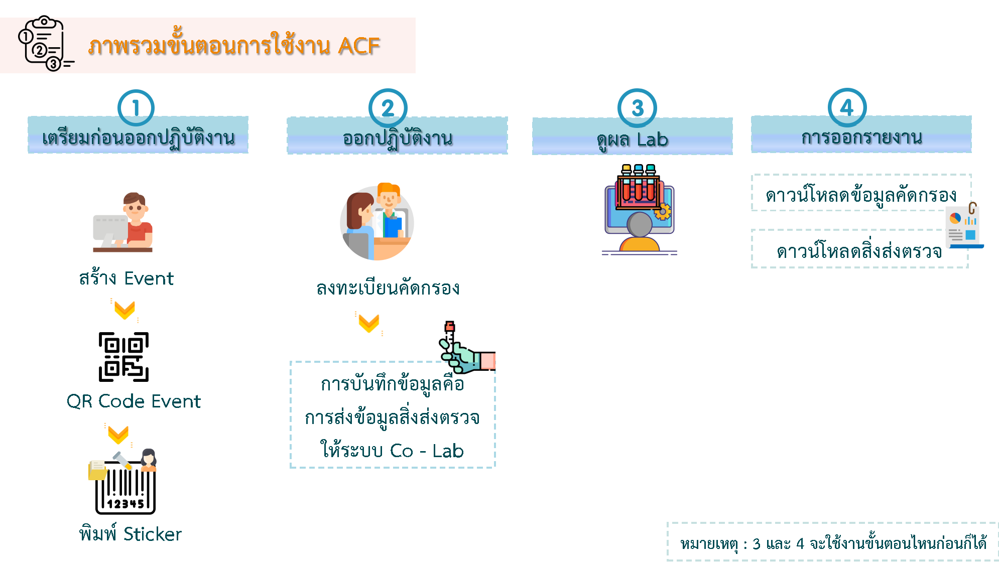

## `Link การใช้งาน`
Link สำหรับทดลองใช้งานระบบ : [https://acf.moph.go.th:8443/th/login](https://acf.moph.go.th:8443/th/login)  
Link สำหรับใช้งานจริง : [https://acf.moph.go.th/th/login](https://acf.moph.go.th/th/login)

## `ภาพรวมการใช้งาน ACF`
ภาพรวมขั้นตอนการใช้งานระบบ ACF 
  
## 1.1. ขั้นตอนการดำเนินการก่อนใช้งานระบบ

1. ทางหน่วยงานต้องดำเนินการส่งรายชื่อเจ้าหน้าที่ผู้จัดการระบบ (Admin ระดับหน่วยงาน) ที่จะทำหน้าที่เพิ่มสิทธิ์ให้แก่เจ้าหน้าที่ผู้ใช้งานของหน่วยงาน (User) โดยสามารถดาวน์โหลดแบบฟอร์มได้ที่ [https://acf.moph.go.th/downloads](https://acf.moph.go.th/th/downloads) พิมพ์รายละเอียดตามแบบฟอร์ม มาส่งยัง plumekamol@moph.go.th (*พิมพ์เท่านั้น)
2. ทาง Admin ของศูนย์เทคโนโลยีสารสนเทศและการสื่อสาร จะดำเนินการเพิ่มสิทธิ์ให้กับผู้จัดการระบบ (Admin ระดับหน่วยงาน) โดยจะตอบกลับทางอีเมลเมื่อเพิ่มสิทธิ์เรียบร้อยแล้ว 
3. Admin ระดับโรงพยาบาล เพิ่มสิทธิ์ให้แก่เจ้าหน้าที่โรงพยาบาลของท่าน (User) โดยสามารถเพิ่มสิทธิ์ด้วยการอัพโหลดไฟล์ Excel หรือสามารถเพิ่มในระบบได้เลย 

## 1.2. ระดับสิทธิ์ในการเข้าใช้ระบบ มี 2 ระดับ ดังนี้

1. ระดับผู้ใช้งาน (User) สำหรับเจ้าหน้าที่ของหน่วยงานที่ต้องการใช้งานระบบ โดยต้องดำเนินการเพิ่มสิทธิ์โดยผู้จัดการระบบ (Admin) ของหน่วยงานก่อน
2. ระดับผู้จัดการระบบ (Admin) สำหรับเจ้าหน้าที่ของหน่วยงานที่ได้รับผิดชอบให้ดำเนินการเพิ่มสิทธิ์ให้ผู้ใช้งาน (User)