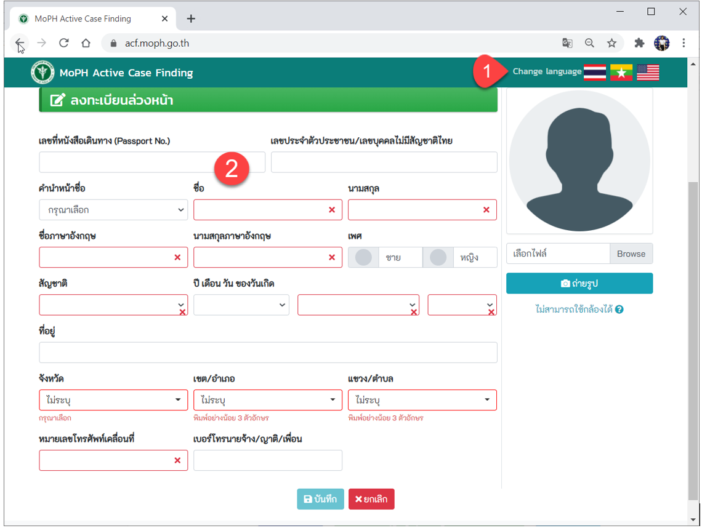
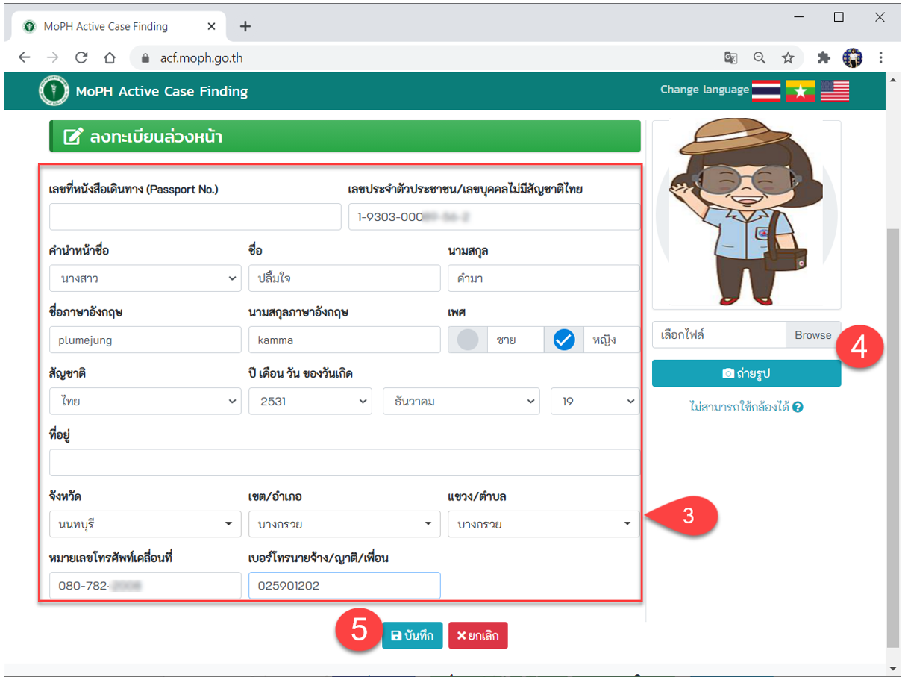
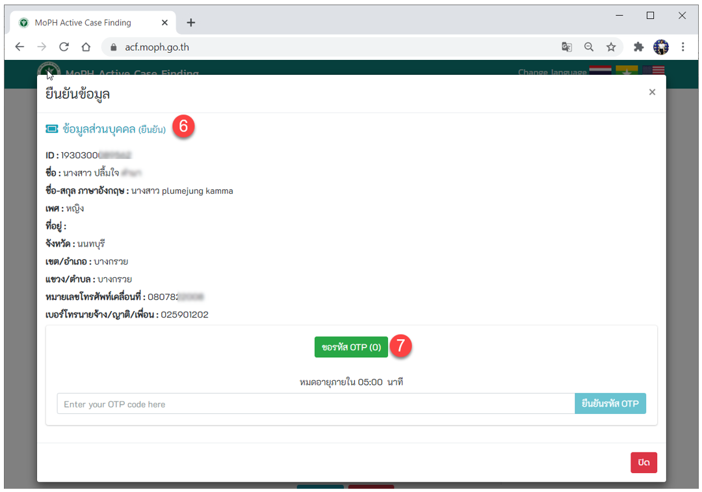
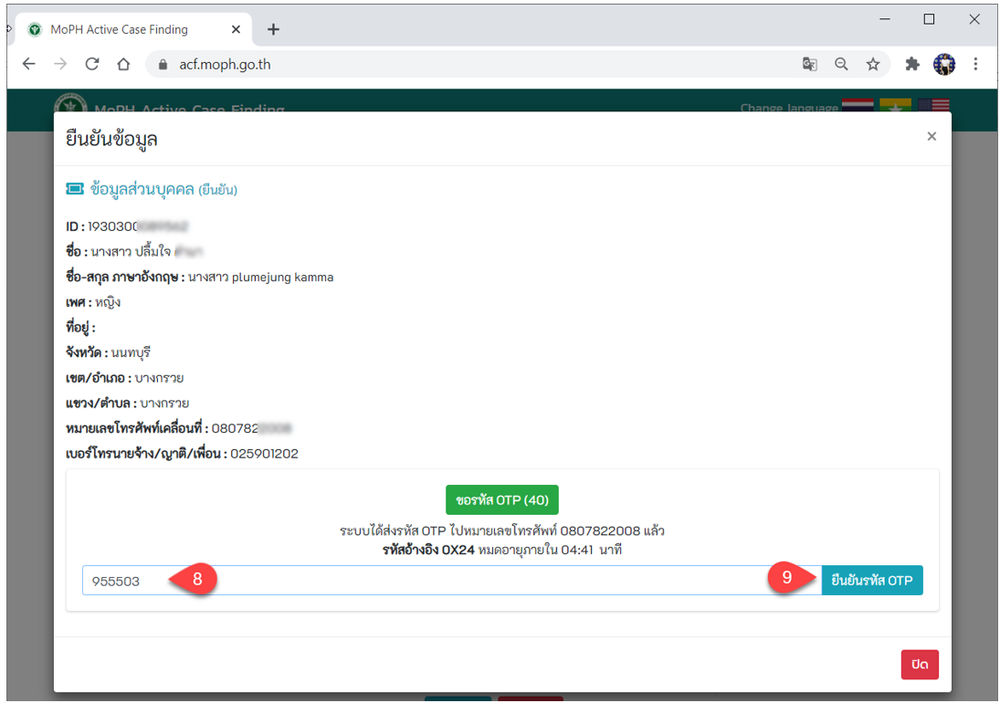
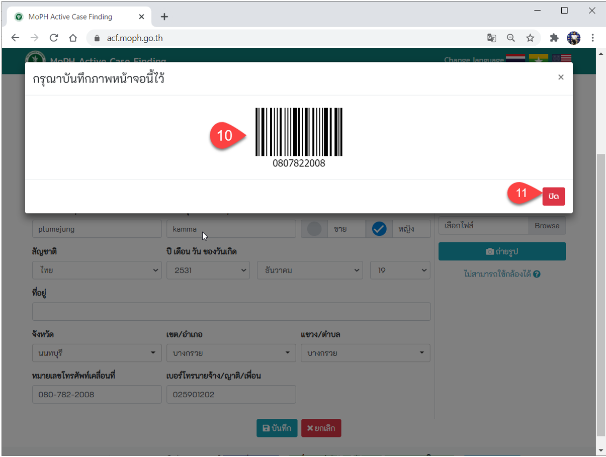

## 2.1. ขั้นตอนการลงทะเบียนล่วงหน้า
เพื่อความสะดวก รวดเร็วในการรับการตรวจคัดกรอง ผู้เข้ารับคัดกรองสามารถลงทะเบียนล่วงหน้าได้ 2 วิธี ดังนี้
1. หน่วยบริการที่ออกคัดกรองจะประชาสัมพันธ์ แจ้งวันเวลาในการออกตรวจ ทางหน่วยบริการจะมีการพิมพ์ QR Code ให้ลงทะเบียนล่วงหน้า เพื่อความรวดเร็วในการเข้ารับคัดกรอง (ลงทะเบียนผ่านมือถือ)
2. สามารถลงทะเบียนล่วงหน้า ได้ที่หน้าเว็บไซต์ที่ https://acf.moph.go.th/th/pre-register
หรือสแกน QR Code
 
เมื่อเลือกวิธีการเข้าหน้าเว็บลงทะเบียนล่วงหน้า ตามวิธีข้างต้นแล้ว จะเข้าสู่ขั้นตอนการลงทะเบียน ดังนี้ 
1. จะเข้าสู่หน้าจอลงทะเบียนล่วงหน้า สามารถเลือกได้ 3 ภาษา  
2. ช่องที่เป็นสีแดงต้องกรอกรายละเอียดให้ครบถ้วน หากกรอกไม่ครบถ้วนจะไม่สามารถบันทึกได้

3. กรอกรายละเอียดข้อมูลของตนเอง     
4. กดปุ่มถ่ายรูป หรือสามารถเลือกรูปที่มีอยู่ในเครื่องได้  
5. กดปุ่ม บันทึก 

6. เข้าสู่หน้าจอการยืนยันข้อมูล   
7. กดปุ่ม ขอรหัส OTP (รหัสจะถูกส่งไปยังข้อความในโทรศัพท์มือถือ ซึ่งรหัสจะหมดอายุภายใน 5 นาที)  

8. กรอกรหัส OTP    
9. กดปุ่ม ยืนยันรหัส OTP  

10. จะปรากฏบาร์โค้ด ให้ผู้เข้ารับคัดกรองบรรทุกภาพหน้าจอนี้ไว้ เพื่อให้เจ้าหน้าที่ ณ จุดคัดกรอง  
11. กดปุ่ม ปิด (การลงทะเบียนล่วงหน้าเรียบร้อย) 

